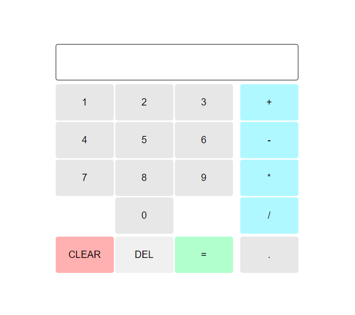

# Calculator

> Calculator

## Table of contents

- [General info](#general-info)
- [Screenshots](#screenshots)
- [Technologies](#technologies)
- [Setup](#setup)
- [Live Application](#live-application)
- [Features](#features)
- [Status](#status)
- [Inspiration](#inspiration)
- [Contact](#contact)

## General info

A claculator built to showcase/practise DOM manipulation, functions and modular code with separation of concerns.

## Screenshots

## Technologies

- HTML
- CSS
- JavaScript

## Setup

Open the index.html in any modern browser.

## Live Application

[Live Application](https://sbillsborough.github.io/calculator-top/)

## Features

- Add, subtract, multiply, divide, decimal, equals, clear and delete.
- Doesn't evaluate more than one pair of numbers at a time.
- Rounds answers with long decimals to 2 decimal places.
- Cannot divide by zero.

## Status

Project is: _finished_

## Inspiration

This calculator is inspired by The Odin Project and used to practise JavaScript fundamentals.

## Contact

Created by [@sbillsborough](https://github.com/sbillsborough) - feel free to contact me!
